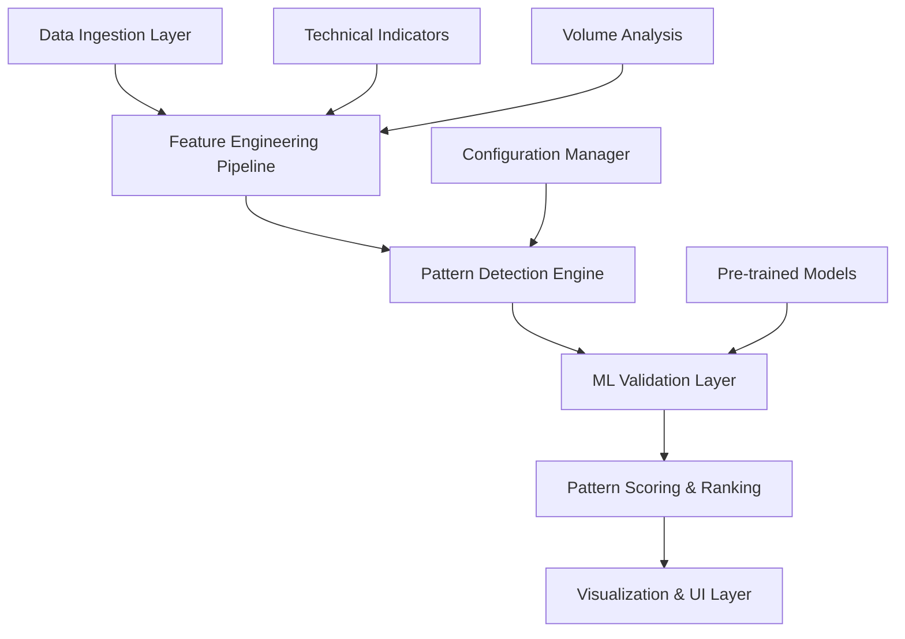

# Design Document

## Overview

The Advanced Stock Pattern Scanner will be a modernized, efficient system that combines traditional technical analysis with state-of-the-art machine learning for accurate pattern detection. The system will be optimized for MacBook performance, utilizing Apple Silicon capabilities while maintaining clean, maintainable code architecture.

## Architecture

### High-Level Architecture



### Core Components

1. **Data Ingestion Layer**: Efficient data fetching and caching using yfinance with error handling
2. **Feature Engineering Pipeline**: Vectorized technical indicator calculations optimized for Apple Silicon
3. **Pattern Detection Engine**: Hybrid approach combining rule-based and ML-based detection
4. **ML Validation Layer**: Pre-trained models for pattern validation and confidence scoring
5. **Pattern Scoring & Ranking**: Multi-criteria scoring system for pattern reliability
6. **Visualization Layer**: Interactive charts with pattern overlays using Plotly

## Components and Interfaces

### 1. Data Manager (`data_manager.py`)

**Purpose**: Handle all data operations with caching and optimization

**Key Classes**:
- `DataManager`: Main data handling class
- `DataCache`: Intelligent caching system with TTL

**Key Methods**:
```python
class DataManager:
    def fetch_stock_data(symbol: str, period: str) -> pd.DataFrame
    def validate_data(df: pd.DataFrame) -> bool
    def preprocess_data(df: pd.DataFrame) -> pd.DataFrame
    def get_cached_data(symbol: str) -> Optional[pd.DataFrame]
```

### 2. Feature Engineering (`feature_engine.py`)

**Purpose**: Generate technical indicators and features for pattern detection

**Key Classes**:
- `FeatureEngine`: Main feature calculation engine
- `TechnicalIndicators`: Collection of optimized indicator calculations

**Key Methods**:
```python
class FeatureEngine:
    def calculate_all_features(df: pd.DataFrame) -> pd.DataFrame
    def calculate_volume_indicators(df: pd.DataFrame) -> pd.DataFrame
    def calculate_momentum_indicators(df: pd.DataFrame) -> pd.DataFrame
    def calculate_trend_indicators(df: pd.DataFrame) -> pd.DataFrame
    def extract_pattern_features(df: pd.DataFrame, window: int) -> np.ndarray
```

### 3. Pattern Detection Engine (`pattern_detector.py`)

**Purpose**: Core pattern detection using hybrid approach

**Key Classes**:
- `HybridPatternDetector`: Main detection engine
- `TraditionalDetector`: Rule-based pattern detection
- `MLPatternValidator`: ML-based pattern validation

**Key Methods**:
```python
class HybridPatternDetector:
    def detect_all_patterns(df: pd.DataFrame) -> Dict[str, List[Pattern]]
    def detect_head_and_shoulders(df: pd.DataFrame) -> List[Pattern]
    def detect_double_patterns(df: pd.DataFrame) -> List[Pattern]
    def detect_cup_and_handle(df: pd.DataFrame) -> List[Pattern]
    def detect_triangles(df: pd.DataFrame) -> List[Pattern]
```

### 4. ML Model Manager (`ml_models.py`)

**Purpose**: Handle pre-trained models optimized for MacBook

**Key Classes**:
- `ModelManager`: Model loading and inference
- `PatternClassifier`: Main classification model
- `ConfidenceScorer`: Pattern confidence calculation

**Key Methods**:
```python
class ModelManager:
    def load_pretrained_model() -> torch.nn.Module
    def predict_pattern(features: np.ndarray) -> Tuple[str, float]
    def validate_pattern(pattern: Pattern, features: np.ndarray) -> float
    def batch_predict(features_batch: np.ndarray) -> List[Tuple[str, float]]
```

### 5. Pattern Scoring (`pattern_scorer.py`)

**Purpose**: Score and rank detected patterns

**Key Classes**:
- `PatternScorer`: Main scoring engine
- `RiskCalculator`: Risk assessment for patterns

**Key Methods**:
```python
class PatternScorer:
    def score_pattern(pattern: Pattern, market_context: Dict) -> float
    def calculate_target_price(pattern: Pattern) -> float
    def calculate_stop_loss(pattern: Pattern) -> float
    def rank_patterns(patterns: List[Pattern]) -> List[Pattern]
```

## Data Models

### Pattern Data Model

```python
@dataclass
class Pattern:
    type: str  # Pattern type (e.g., "Head and Shoulders")
    symbol: str  # Stock symbol
    timeframe: str  # Timeframe (e.g., "1d", "1h")
    
    # Key points
    key_points: List[Tuple[int, float]]  # (index, price) pairs
    
    # Pattern metrics
    confidence: float  # ML confidence score (0-1)
    traditional_score: float  # Rule-based score (0-1)
    combined_score: float  # Final combined score
    
    # Trading information
    entry_price: float
    target_price: float
    stop_loss: float
    risk_reward_ratio: float
    
    # Pattern details
    formation_start: datetime
    formation_end: datetime
    breakout_date: Optional[datetime]
    status: str  # "forming", "confirmed", "failed"
    
    # Volume analysis
    volume_confirmation: bool
    avg_volume_ratio: float
    
    # Additional metadata
    detection_method: str  # "traditional", "ml", "hybrid"
    pattern_height: float
    duration_days: int
```

### Configuration Model

```python
@dataclass
class PatternConfig:
    # Detection thresholds
    min_confidence: float = 0.7
    min_pattern_duration: int = 20
    max_pattern_duration: int = 200
    
    # Volume requirements
    volume_confirmation_required: bool = True
    min_volume_ratio: float = 1.2
    
    # Pattern-specific settings
    head_shoulders_tolerance: float = 0.05
    double_pattern_tolerance: float = 0.03
    cup_handle_depth_min: float = 0.15
    triangle_convergence_min: float = 0.02
    
    # ML model settings
    model_path: str = "models/pattern_classifier.pth"
    use_gpu: bool = True
    batch_size: int = 32
```

## Error Handling

### Error Categories

1. **Data Errors**: Missing data, API failures, invalid symbols
2. **Model Errors**: Model loading failures, prediction errors
3. **Pattern Errors**: Invalid pattern formations, insufficient data
4. **System Errors**: Memory issues, performance problems

### Error Handling Strategy

```python
class PatternDetectionError(Exception):
    """Base exception for pattern detection errors"""
    pass

class DataError(PatternDetectionError):
    """Data-related errors"""
    pass

class ModelError(PatternDetectionError):
    """ML model-related errors"""
    pass

# Error handling with graceful degradation
try:
    ml_result = ml_validator.validate_pattern(pattern)
except ModelError:
    # Fall back to traditional validation
    ml_result = traditional_validator.validate_pattern(pattern)
```

## Testing Strategy

### Unit Testing

1. **Data Processing Tests**: Validate data cleaning and feature engineering
2. **Pattern Detection Tests**: Test individual pattern detection algorithms
3. **ML Model Tests**: Validate model loading and inference
4. **Scoring Tests**: Test pattern scoring and ranking logic

### Integration Testing

1. **End-to-End Pipeline Tests**: Full workflow from data to results
2. **Performance Tests**: Memory usage and execution time benchmarks
3. **MacBook Optimization Tests**: Apple Silicon specific optimizations

### Test Data Strategy

1. **Synthetic Data**: Generated patterns with known characteristics
2. **Historical Data**: Real market data with manually verified patterns
3. **Edge Cases**: Unusual market conditions and data anomalies

## Performance Optimizations

### MacBook-Specific Optimizations

1. **Apple Silicon Utilization**:
   - Use PyTorch with MPS (Metal Performance Shaders) backend
   - Leverage Core ML for inference when possible
   - Utilize ARM64 optimized NumPy operations

2. **Memory Management**:
   - Implement data streaming for large datasets
   - Use memory-mapped files for model weights
   - Efficient garbage collection strategies

3. **Parallel Processing**:
   - Multi-threading for independent pattern detection
   - Vectorized operations using Apple's Accelerate framework
   - Asynchronous data fetching

### Code Optimizations

```python
# Example: Vectorized pattern detection
def detect_peaks_vectorized(prices: np.ndarray, order: int = 5) -> np.ndarray:
    """Optimized peak detection using vectorized operations"""
    # Use scipy's optimized implementation
    peaks = signal.find_peaks(prices, distance=order)[0]
    
    # Filter peaks using vectorized operations
    peak_heights = prices[peaks]
    threshold = np.percentile(prices, 75)
    significant_peaks = peaks[peak_heights > threshold]
    
    return significant_peaks
```

## Model Architecture

### Pre-trained Model Selection

**Primary Model**: Custom CNN-LSTM hybrid trained on financial time series
- **Input**: 60-day price/volume sequences with technical indicators
- **Architecture**: 1D CNN for local pattern extraction + LSTM for temporal dependencies
- **Output**: Pattern classification + confidence score

**Fallback Model**: Ensemble of traditional ML models
- **Random Forest**: For robust pattern classification
- **SVM**: For pattern boundary detection
- **Isolation Forest**: For anomaly detection in patterns

### Model Training Strategy

```python
class PatternCNNLSTM(nn.Module):
    def __init__(self, input_features=10, sequence_length=60, num_classes=5):
        super().__init__()
        
        # CNN layers for local pattern extraction
        self.conv1d = nn.Sequential(
            nn.Conv1d(input_features, 64, kernel_size=3, padding=1),
            nn.ReLU(),
            nn.BatchNorm1d(64),
            nn.Conv1d(64, 128, kernel_size=3, padding=1),
            nn.ReLU(),
            nn.BatchNorm1d(128),
            nn.MaxPool1d(2)
        )
        
        # LSTM for temporal dependencies
        self.lstm = nn.LSTM(128, 256, batch_first=True, dropout=0.2)
        
        # Classification head
        self.classifier = nn.Sequential(
            nn.Linear(256, 128),
            nn.ReLU(),
            nn.Dropout(0.3),
            nn.Linear(128, num_classes)
        )
        
        # Confidence head
        self.confidence = nn.Sequential(
            nn.Linear(256, 64),
            nn.ReLU(),
            nn.Linear(64, 1),
            nn.Sigmoid()
        )
```

## Integration Points

### External APIs
- **Yahoo Finance**: Primary data source with fallback to Alpha Vantage
- **Core ML**: For optimized inference on Apple Silicon
- **Hugging Face**: For accessing pre-trained financial models

### Internal Components
- **Streamlit UI**: Interactive web interface
- **Plotly**: Advanced charting with pattern overlays
- **SQLite**: Local caching database for performance

## Security Considerations

1. **API Key Management**: Secure storage of API keys using environment variables
2. **Data Validation**: Input sanitization to prevent injection attacks
3. **Model Security**: Verify model integrity before loading
4. **User Data**: No storage of sensitive trading information

## Deployment Strategy

### Local Development
- **Environment**: Python 3.9+ with virtual environment
- **Dependencies**: Locked versions in requirements.txt
- **Configuration**: Environment-based configuration management

### Production Considerations
- **Model Versioning**: Semantic versioning for model updates
- **Monitoring**: Performance metrics and error tracking
- **Updates**: Automated model and dependency updates